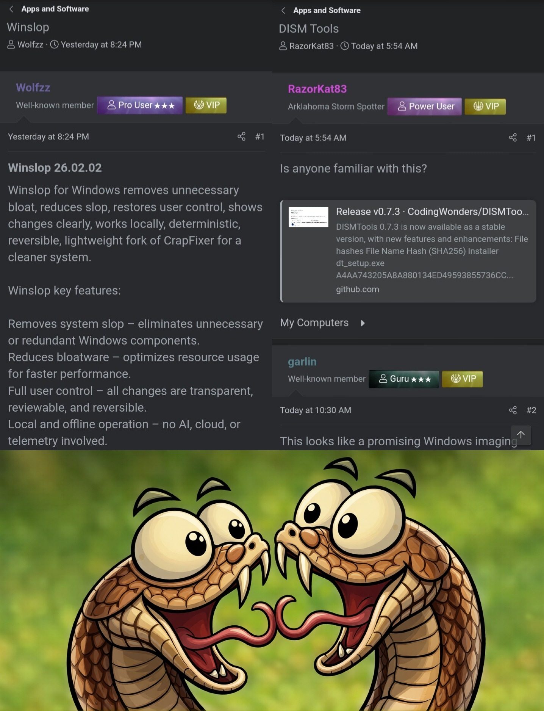
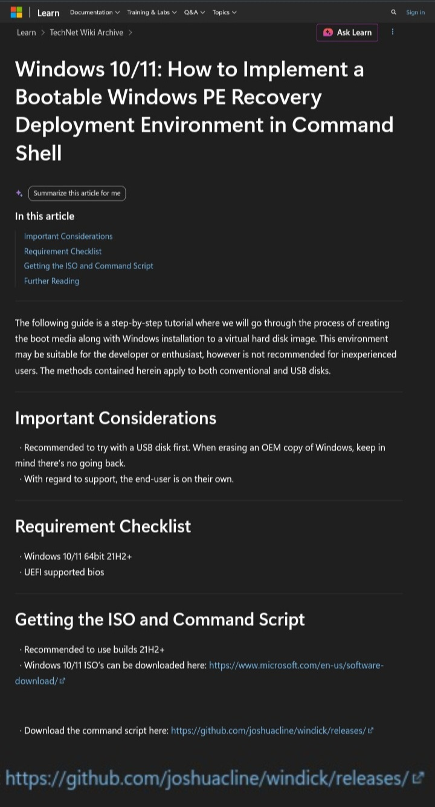
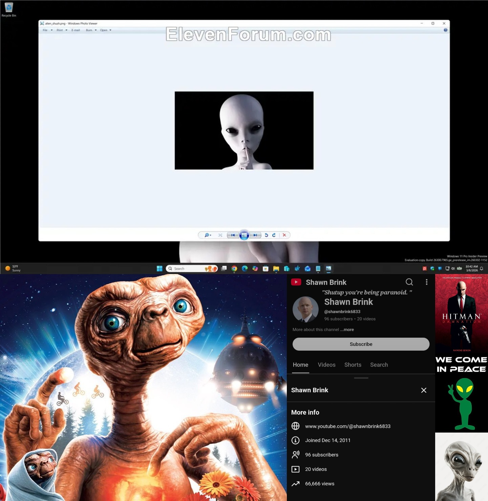
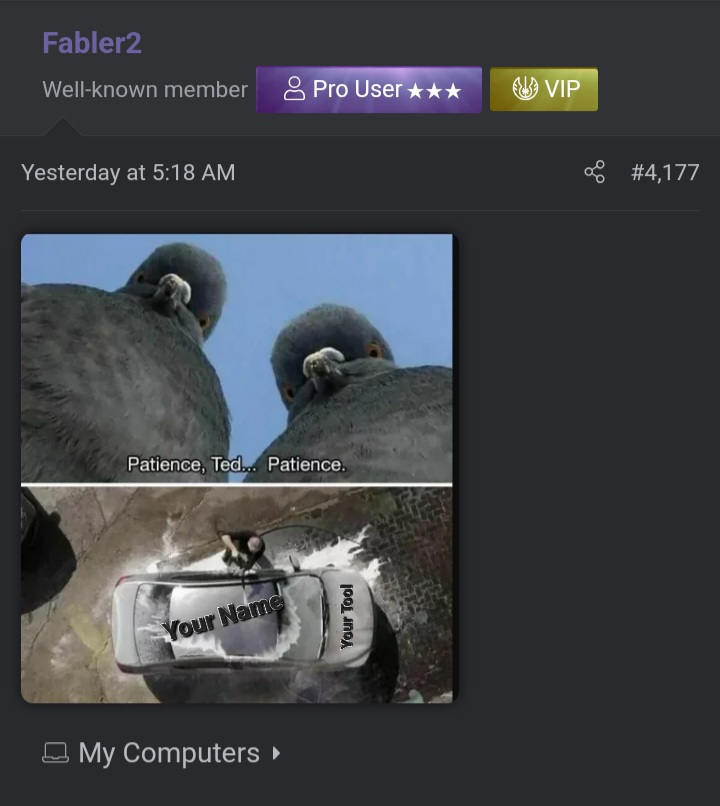
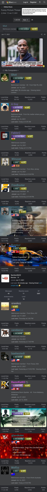

# The-Final-Frontier
***I want to scare you...because there are much worse things that can happen to you than being afraid.***

- Once upon a time, the internet was fresh and new. Everyone participated. The helpers, the doers, kind people, and of course the other side of that coin. There was a natural balance that propelled a sense of community, progress, and humanity. This is no more, and it hasn't been for a long time.

# Communities will only hurt you

- Forever in loathing. Looking beneath the facade is an environment in strife, where confidence is no longer a commodity. In its place is a psyop of constant devaluation between anyone who remains. Wisdom teaches us that the pimped and desperate are not the kind of folks you want in your corner, unless of course you're one of them.

- What are SimpCities? I'll give you a hint: It's all that stands beside the pile of rubble, and once seen cannot be unseen. The depressing reality is that it only takes one to divide, control, and conquer an entire community. Thankfully there are some of us who stopped counting upon reaching a beautiful and round one hundred 💯 while in our twenties. There's no longer any power or control over an individual once they've been around the block, not unlike Dale Earnhardt.

# Noble gatekeepers or viciously incompetent megalomaniacs?

- Imagine sharing your app with communities, only to be swiftly dog-piled and then disappeared, while the fat cats eat your breakfast, lunch, and dinner. Literally.

- ***The company you keep says a lot. Maybe it's for the best.***

- A beautiful day in the neighborhood? If you're legally blind.

# Wait a minute..Who's the real Microsoft? That's right
 

# Sounding the alarm so everyone can breathe 🚨

- See something, Say nothing.

- He's an alright extraterrestrial and dedicated to his work..to the best of my knowledge.

Ever wonder the who and the how behind your tool getting flagged? Sometimes the answer can be quite simple, like a malicious moron leveraging your scripting methods, ***ignorantly as if it was commonly used code.***

# What does parallel construction look like?

- When a group is so heavily invested in ruining a person, it's nearly impossible to walk away empty handed..but you don't have to take my word for it.
